# Design Document: Intraday Market Monitoring

## Overview

The intraday market monitoring feature extends the existing stock market analysis system to enable hourly monitoring and automated trading during market hours. The system monitors stocks across multiple regional markets (China, Hong Kong, USA), respects market hours and holidays, and automatically executes trades based on analysis results.

### Key Design Goals

- Operate independently from existing daily analysis scheduler
- Support multiple regional markets with different timezones and trading hours
- Accurate timezone conversion with daylight saving time support
- Graceful error handling and recovery
- Resource-efficient operation with configurable monitoring intervals
- Seamless integration with existing Analysis Engine and Trade Executor components

### System Context

The intraday monitoring system integrates with:
- Existing Scheduler component (operates independently)
- Analysis Engine (shared for both daily and intraday analysis)
- Trade Executor (shared for both daily and intraday trading)
- Configuration Manager (extended with intraday settings)
- Market Monitor (for data collection)

## Architecture

### Component Overview


### Component Responsibilities

#### Intraday Monitor
- Schedule and coordinate hourly analysis cycles during market hours
- Manage separate schedules for each regional market
- Check market status before each analysis cycle
- Handle errors and implement retry logic
- Log monitoring events and status
- Coordinate with Analysis Engine and Trade Executor

#### Market Hours Detector
- Determine if a regional market is currently open
- Maintain trading hours for each market in local timezone
- Handle weekend detection
- Support market holiday configuration
- Provide market status queries

#### Timezone Converter
- Convert times between UTC and regional timezones
- Handle daylight saving time transitions for USA markets
- Maintain accuracy within 1 minute
- Support China Standard Time (UTC+8, no DST)
- Support Hong Kong Time (UTC+8, no DST)
- Support USA Eastern Time (UTC-5/UTC-4 with DST)

### Data Flow


### Multi-Region Scheduling

```mermaid
gantt
    title Intraday Monitoring Across Timezones
    dateFormat HH:mm
    axisFormat %H:%M
    
    section China (UTC+8)
    Market Open (09:30 CST = 01:30 UTC) : milestone, 01:30, 0m
    Trading Hours : active, 01:30, 5h30m
    Market Close (15:00 CST = 07:00 UTC) : milestone, 07:00, 0m
    
    section Hong Kong (UTC+8)
    Market Open (09:30 HKT = 01:30 UTC) : milestone, 01:30, 0m
    Trading Hours : active, 01:30, 6h30m
    Market Close (16:00 HKT = 08:00 UTC) : milestone, 08:00, 0m
    
    section USA (UTC-5 winter)
    Market Open (09:30 EST = 14:30 UTC) : milestone, 14:30, 0m
    Trading Hours : active, 14:30, 6h30m
    Market Close (16:00 EST = 21:00 UTC) : milestone, 21:00, 0m
```



## Components and Interfaces

### Intraday Monitor

```python
class IntradayMonitor:
    """
    Coordinates hourly market monitoring and analysis during trading hours.
    """
    
    def __init__(
        self,
        market_hours_detector: MarketHoursDetector,
        analysis_engine: AnalysisEngine,
        trade_executor: TradeExecutor,
        config_manager: ConfigurationManager,
        logger: Optional[logging.Logger] = None
    ):
        """Initialize the intraday monitor."""
        pass
    
    def start_monitoring(self) -> None:
        """
        Start intraday monitoring for configured markets.
        Creates separate monitoring loops for each regional market.
        """
        pass
    
    def stop_monitoring(self) -> None:
        """
        Stop all monitoring activities.
        Allows in-progress cycles to complete.
        Completes cleanup within 30 seconds.
        """
        pass
    
    def execute_analysis_cycle(self, region: MarketRegion) -> AnalysisCycleResult:
        """
        Execute a single analysis cycle for a regional market.
        
        Returns:
            AnalysisCycleResult with success status, trade count, and errors
        """
        pass
    
    def get_monitoring_status(self, region: MarketRegion) -> MonitoringStatus:
        """
        Query current monitoring status for a regional market.
        
        Returns:
            MonitoringStatus with active/paused state, last cycle time, next cycle time
        """
        pass
    
    def _should_execute_cycle(self, region: MarketRegion) -> bool:
        """Check if analysis cycle should execute for the given region."""
        pass
    
    def _handle_cycle_error(self, region: MarketRegion, error: Exception) -> None:
        """Handle errors during analysis cycle execution."""
        pass
    
    def _pause_monitoring(self, region: MarketRegion, duration_minutes: int, reason: str) -> None:
        """Pause monitoring for a region due to repeated failures."""
        pass
```

### Market Hours Detector

```python
class MarketHoursDetector:
    """
    Determines if regional markets are currently open for trading.
    """
    
    # Market trading hours in local timezone
    MARKET_HOURS = {
        MarketRegion.CHINA: {
            'open': time(9, 30),
            'close': time(15, 0),
            'timezone': 'Asia/Shanghai'  # UTC+8, no DST
        },
        MarketRegion.HONG_KONG: {
            'open': time(9, 30),
            'close': time(16, 0),
            'timezone': 'Asia/Hong_Kong'  # UTC+8, no DST
        },
        MarketRegion.USA: {
            'open': time(9, 30),
            'close': time(16, 0),
            'timezone': 'America/New_York'  # UTC-5/UTC-4 with DST
        }
    }
    
    def __init__(
        self,
        timezone_converter: TimezoneConverter,
        config_manager: ConfigurationManager,
        logger: Optional[logging.Logger] = None
    ):
        """Initialize market hours detector."""
        pass
    
    def is_market_open(self, region: MarketRegion, check_time: Optional[datetime] = None) -> bool:
        """
        Check if a regional market is currently open.
        
        Args:
            region: Market region to check
            check_time: Time to check (defaults to current UTC time)
            
        Returns:
            True if market is open, False otherwise
        """
        pass
    
    def is_weekend(self, local_time: datetime) -> bool:
        """Check if the given time falls on a weekend."""
        pass
    
    def is_market_holiday(self, region: MarketRegion, date: datetime.date) -> bool:
        """Check if the given date is a market holiday for the region."""
        pass
    
    def get_market_hours(self, region: MarketRegion) -> tuple[time, time]:
        """
        Get market open and close times in local timezone.
        
        Returns:
            Tuple of (open_time, close_time)
        """
        pass
    
    def load_holidays(self, region: MarketRegion) -> List[datetime.date]:
        """Load market holidays from configuration."""
        pass
```

### Timezone Converter

```python
class TimezoneConverter:
    """
    Handles timezone conversions with daylight saving time support.
    """
    
    def __init__(self, logger: Optional[logging.Logger] = None):
        """Initialize timezone converter."""
        pass
    
    def utc_to_local(self, utc_time: datetime, timezone_name: str) -> datetime:
        """
        Convert UTC time to local timezone.
        
        Args:
            utc_time: Time in UTC
            timezone_name: Target timezone (e.g., 'America/New_York')
            
        Returns:
            Time in local timezone
        """
        pass
    
    def local_to_utc(self, local_time: datetime, timezone_name: str) -> datetime:
        """
        Convert local time to UTC.
        
        Args:
            local_time: Time in local timezone
            timezone_name: Source timezone
            
        Returns:
            Time in UTC
        """
        pass
    
    def get_timezone_offset(self, timezone_name: str, dt: datetime) -> timedelta:
        """
        Get UTC offset for a timezone at a specific datetime.
        Handles daylight saving time transitions.
        """
        pass
```

### Configuration Extensions

```python
# Extensions to ConfigurationManager

def get_intraday_config(self) -> dict:
    """
    Returns intraday monitoring configuration.
    
    Returns:
        Dictionary with:
        - enabled: bool
        - monitoring_interval_minutes: int (15-240)
        - monitored_regions: List[MarketRegion]
    """
    pass

def get_market_holidays(self, region: MarketRegion) -> List[str]:
    """
    Returns list of market holidays for a region.
    
    Returns:
        List of dates in YYYY-MM-DD format
    """
    pass

def set_intraday_config(self, enabled: bool, interval_minutes: int, regions: List[MarketRegion]) -> Result:
    """
    Set intraday monitoring configuration.
    
    Validates:
    - interval_minutes is between 15 and 240
    - at least one region is specified
    """
    pass
```

### Data Models

```python
@dataclass
class AnalysisCycleResult:
    """Result of an analysis cycle execution."""
    success: bool
    region: MarketRegion
    start_time: datetime
    end_time: datetime
    recommendations_count: int
    trades_executed: int
    error_message: Optional[str] = None

@dataclass
class MonitoringStatus:
    """Current status of intraday monitoring for a region."""
    region: MarketRegion
    is_active: bool
    is_paused: bool
    pause_reason: Optional[str]
    pause_until: Optional[datetime]
    last_cycle_time: Optional[datetime]
    next_cycle_time: Optional[datetime]
    consecutive_failures: int
    total_cycles_today: int
```

## Data Models

### Configuration Schema

The intraday monitoring configuration extends the existing `config/default.yaml`:

```yaml
intraday_monitoring:
  enabled: true
  monitoring_interval_minutes: 60  # 15-240 minutes
  monitored_regions:
    - china
    - hong_kong
    - usa
  
  market_holidays:
    china:
      - "2024-01-01"  # New Year's Day
      - "2024-02-10"  # Spring Festival
      # ... additional holidays
    hong_kong:
      - "2024-01-01"  # New Year's Day
      - "2024-02-10"  # Lunar New Year
      # ... additional holidays
    usa:
      - "2024-01-01"  # New Year's Day
      - "2024-07-04"  # Independence Day
      - "2024-12-25"  # Christmas
      # ... additional holidays
```

### Market Hours Reference

| Region | Market | Open (Local) | Close (Local) | Timezone | UTC Offset |
|--------|--------|--------------|---------------|----------|------------|
| China | SSE/SZSE | 09:30 | 15:00 | CST | UTC+8 (no DST) |
| Hong Kong | HKEX | 09:30 | 16:00 | HKT | UTC+8 (no DST) |
| USA | NYSE/NASDAQ | 09:30 | 16:00 | ET | UTC-5 (winter) / UTC-4 (summer) |

### Timezone Handling Strategy

The system uses the `pytz` library for timezone conversions:

- China: `Asia/Shanghai` (UTC+8, no daylight saving)
- Hong Kong: `Asia/Hong_Kong` (UTC+8, no daylight saving)
- USA: `America/New_York` (UTC-5 winter EST, UTC-4 summer EDT)

All internal timestamps are stored in UTC. Conversions to local time happen only when:
1. Checking if current time falls within market hours
2. Logging events with local market time context
3. Displaying status information to users


## Correctness Properties

*A property is a characteristic or behavior that should hold true across all valid executions of a system—essentially, a formal statement about what the system should do. Properties serve as the bridge between human-readable specifications and machine-verifiable correctness guarantees.*

### Property Reflection

After analyzing all acceptance criteria, I identified the following redundancies:
- Properties 1.3 and 11.1 both test non-overlapping cycles - combined into single property
- Properties 6.1 and 6.2 both test independent operation - combined into single property
- Properties 7.3 and 7.5 both test graceful completion during market close - combined
- Properties 8.2 and 8.4 both test independent market schedules - combined
- Properties 12.1 and 12.5 both test DST handling - combined
- Property 5.4 duplicates 1.5 - removed
- Property 6.3 is subsumed by 6.2 - removed
- Properties 8.4 and 8.5 are covered by 8.1 and 8.2 - removed

### Property 1: Analysis Cycle Initiation During Market Hours

*For any* regional market with intraday monitoring enabled, when a trading hour begins and the market is open, the Intraday Monitor should initiate an analysis cycle.

**Validates: Requirements 1.1**

### Property 2: Analysis Cycles Execute at Configured Intervals

*For any* valid monitoring interval configuration (15-240 minutes), the Intraday Monitor should execute analysis cycles at that interval when the market is open.

**Validates: Requirements 1.2**

### Property 3: Sequential Cycle Execution Without Overlap

*For any* regional market, the Intraday Monitor should complete each analysis cycle before starting the next cycle, ensuring no concurrent cycles for the same market.

**Validates: Requirements 1.3, 11.1**

### Property 4: Monitoring Interval Validation

*For any* monitoring interval value, the Configuration Manager should accept values between 15 and 240 minutes (inclusive) and reject values outside this range.

**Validates: Requirements 1.5, 5.6**

### Property 5: Market Hours Detection Accuracy

*For any* UTC timestamp and regional market, the Market Hours Detector should correctly determine whether that time falls within the market's trading hours in its local timezone.

**Validates: Requirements 2.1**

### Property 6: Timezone Conversion Correctness

*For any* UTC timestamp, the Timezone Converter should convert it to the correct local time for each regional market's timezone.

**Validates: Requirements 2.3**

### Property 7: Weekend Market Closure

*For any* date that falls on a Saturday or Sunday, the Market Hours Detector should return false for market open status regardless of the time of day.

**Validates: Requirements 2.4**

### Property 8: Holiday Market Closure

*For any* date configured as a market holiday for a regional market, the Market Hours Detector should return false for market open status for that market.

**Validates: Requirements 3.2**

### Property 9: Holiday Date Format Validation

*For any* holiday date string, the Market Hours Detector should accept valid YYYY-MM-DD format dates and reject invalid formats.

**Validates: Requirements 3.4**

### Property 10: Analysis Results Passed to Trade Executor

*For any* completed analysis cycle, the Intraday Monitor should pass the analysis results to the Trade Executor.

**Validates: Requirements 4.1**

### Property 11: Error Recovery and Continuation

*For any* analysis cycle failure or trade execution failure, the Intraday Monitor should log the error and continue with the next scheduled cycle.

**Validates: Requirements 4.4, 10.1**

### Property 12: Trade Timestamp Recording

*For any* executed trade decision, the Intraday Monitor should record a timestamp in the trade history.

**Validates: Requirements 4.5**

### Property 13: Monitoring Disabled Prevents Cycles

*For any* time period when intraday monitoring is disabled in configuration, the Intraday Monitor should not initiate any analysis cycles.

**Validates: Requirements 5.2**

### Property 14: Independent Operation from Daily Scheduler

*For any* system state where both daily analysis and intraday monitoring are enabled, both should execute without interfering with each other's operation.

**Validates: Requirements 6.1, 6.2**

### Property 15: Market Open Triggers Monitoring Start

*For any* regional market, when the market transitions from closed to open, the Intraday Monitor should begin scheduling analysis cycles for that market's stocks.

**Validates: Requirements 7.1**

### Property 16: Market Close Stops New Cycles

*For any* regional market, when the market transitions from open to closed, the Intraday Monitor should stop scheduling new analysis cycles for that market's stocks.

**Validates: Requirements 7.2**

### Property 17: Graceful Cycle Completion on Market Close

*For any* in-progress analysis cycle when a market closes, the Intraday Monitor should allow the cycle to complete before stopping.

**Validates: Requirements 7.3, 7.5**

### Property 18: Market Status Check Before Each Cycle

*For any* scheduled analysis cycle, the Intraday Monitor should check the market status before executing the cycle.

**Validates: Requirements 7.4**

### Property 19: Multi-Market Concurrent Monitoring

*For any* configuration with multiple regional markets enabled, the Intraday Monitor should monitor all markets concurrently without interference.

**Validates: Requirements 8.1**

### Property 20: Independent Market Schedules

*For any* set of regional markets being monitored, the Intraday Monitor should maintain separate, independent analysis cycle schedules for each market based on that market's trading hours.

**Validates: Requirements 8.2, 8.4, 8.5**

### Property 21: Stock Grouping by Region

*For any* set of stocks from multiple regional markets, the Intraday Monitor should correctly group stocks by their regional market.

**Validates: Requirements 8.3**

### Property 22: Cycle Start Logging

*For any* analysis cycle that starts, the Intraday Monitor should log an entry containing the cycle start time and the regional market being analyzed.

**Validates: Requirements 9.1**

### Property 23: Cycle Completion Logging

*For any* analysis cycle that completes, the Intraday Monitor should log an entry containing the completion time and the number of trade decisions made.

**Validates: Requirements 9.2**

### Property 24: Market Open Event Logging

*For any* regional market that opens, the Intraday Monitor should log a market open event.

**Validates: Requirements 9.3**

### Property 25: Market Close Event Logging

*For any* regional market that closes, the Intraday Monitor should log a market close event.

**Validates: Requirements 9.4**

### Property 26: Market Status Check Failure Logging

*For any* market status check that fails, the Intraday Monitor should log an error with details about the failure.

**Validates: Requirements 9.5**

### Property 27: Fail-Safe Market Closure Assumption

*For any* situation where the Market Hours Detector cannot determine market status, the Intraday Monitor should assume the market is closed and skip the analysis cycle.

**Validates: Requirements 10.2**

### Property 28: Timezone Converter Failure Recovery

*For any* timezone conversion failure, the Intraday Monitor should log an error and retry on the next cycle.

**Validates: Requirements 10.3**

### Property 29: Circuit Breaker After Consecutive Failures

*For any* regional market, if three consecutive analysis cycles fail, the Intraday Monitor should pause monitoring for that market for 30 minutes.

**Validates: Requirements 10.4**

### Property 30: Pause Event Logging

*For any* monitoring pause due to errors, the Intraday Monitor should log a warning containing the pause duration and reason.

**Validates: Requirements 10.5**

### Property 31: Resume After Pause Period

*For any* paused market, when the pause period expires and the market is still open, the Intraday Monitor should resume monitoring.

**Validates: Requirements 10.6**

### Property 32: Resource Cleanup on Disable

*For any* transition from monitoring enabled to disabled, the Intraday Monitor should release all resources.

**Validates: Requirements 11.3**

### Property 33: Component Instance Reuse

*For any* sequence of analysis cycles, the Intraday Monitor should reuse the same Analysis Engine and Trade Executor instances rather than creating new instances.

**Validates: Requirements 11.5**

### Property 34: Daylight Saving Time Handling

*For any* timestamp around a daylight saving time transition in USA Eastern Time, the Timezone Converter should apply the correct UTC offset (UTC-5 for EST, UTC-4 for EDT) based on the date.

**Validates: Requirements 12.1, 12.5**

### Property 35: China Standard Time Conversion

*For any* timestamp, the Timezone Converter should convert between UTC and China Standard Time using a fixed UTC+8 offset without daylight saving adjustments.

**Validates: Requirements 12.2**

### Property 36: Hong Kong Time Conversion

*For any* timestamp, the Timezone Converter should convert between UTC and Hong Kong Time using a fixed UTC+8 offset without daylight saving adjustments.

**Validates: Requirements 12.3**

### Property 37: Timezone Conversion Round-Trip Accuracy

*For any* timestamp and timezone, converting from UTC to local time and back to UTC should produce the original timestamp within 1 minute accuracy.

**Validates: Requirements 12.4**


## Error Handling

### Error Categories and Responses

#### 1. Market Data Collection Errors

**Scenario**: Market Monitor fails to collect data for analysis

**Response**:
- Log error with details (region, timestamp, error message)
- Skip current analysis cycle
- Continue with next scheduled cycle
- Increment failure counter for circuit breaker logic

**Recovery**: Automatic retry on next cycle

#### 2. Analysis Engine Errors

**Scenario**: Analysis Engine fails during stock analysis

**Response**:
- Log error with stack trace
- Return partial results if any stocks were successfully analyzed
- Mark cycle as failed
- Increment failure counter
- Continue with next scheduled cycle

**Recovery**: Automatic retry on next cycle

#### 3. Trade Execution Errors

**Scenario**: Trade Executor fails to execute a trade

**Response**:
- Log error with trade details (symbol, action, reason)
- Continue processing remaining recommendations
- Mark trade as failed in history
- Do not increment cycle failure counter (trade failures don't stop monitoring)

**Recovery**: Trade will be retried if recommendation appears in next cycle

#### 4. Market Hours Detection Errors

**Scenario**: Cannot determine if market is open (timezone conversion fails, configuration missing)

**Response**:
- Log error with details
- Assume market is closed (fail-safe behavior)
- Skip analysis cycle
- Retry on next cycle

**Recovery**: Automatic retry on next cycle

#### 5. Configuration Errors

**Scenario**: Invalid configuration values (interval out of range, invalid region, malformed holiday dates)

**Response**:
- Reject configuration change with validation error
- Keep existing valid configuration
- Log validation error
- Return error to caller

**Recovery**: User must provide valid configuration

#### 6. Consecutive Failure Circuit Breaker

**Scenario**: Three consecutive analysis cycles fail for a market

**Response**:
- Pause monitoring for that market for 30 minutes
- Log warning with pause reason and duration
- Continue monitoring other markets
- Reset failure counter after successful cycle

**Recovery**: Automatic resume after 30 minutes if market still open

#### 7. Resource Exhaustion

**Scenario**: System CPU usage exceeds 80%

**Response**:
- Delay next analysis cycle by 5 minutes
- Log resource constraint warning
- Continue monitoring after delay

**Recovery**: Automatic when resources available

#### 8. Shutdown During Active Cycle

**Scenario**: System shutdown requested while cycle is running

**Response**:
- Set shutdown flag
- Allow current cycle to complete (with 30-second timeout)
- Stop scheduling new cycles
- Release all resources
- Log graceful shutdown

**Recovery**: Resume on next system start

### Error Logging Format

All errors are logged with structured information:

```python
{
    "timestamp": "2024-01-15T10:30:45Z",
    "level": "ERROR",
    "component": "IntradayMonitor",
    "region": "usa",
    "error_type": "AnalysisFailure",
    "message": "Analysis cycle failed: connection timeout",
    "details": {
        "cycle_id": "abc123",
        "retry_count": 1,
        "consecutive_failures": 2
    }
}
```

### Retry Strategy

| Error Type | Retry Behavior | Max Retries | Backoff |
|------------|----------------|-------------|---------|
| Data Collection | Next cycle | Unlimited | Monitoring interval |
| Analysis Engine | Next cycle | Unlimited | Monitoring interval |
| Trade Execution | Next cycle (if recommendation persists) | Unlimited | Monitoring interval |
| Market Hours Detection | Next cycle | Unlimited | Monitoring interval |
| Configuration | Manual fix required | N/A | N/A |
| Timezone Conversion | Next cycle | Unlimited | Monitoring interval |

### Circuit Breaker Behavior


## Testing Strategy

### Dual Testing Approach

The intraday monitoring feature requires both unit tests and property-based tests for comprehensive coverage:

- **Unit tests**: Verify specific examples, edge cases, integration points, and error conditions
- **Property-based tests**: Verify universal properties across all inputs using randomized testing

Together, these approaches provide comprehensive coverage where unit tests catch concrete bugs and property tests verify general correctness across the input space.

### Property-Based Testing

We will use **Hypothesis** (Python's property-based testing library) for all property tests. Each property test will:

- Run a minimum of 100 iterations with randomized inputs
- Reference the design document property it validates
- Use the tag format: `# Feature: intraday-market-monitoring, Property {number}: {property_text}`

#### Property Test Examples

**Property 5: Market Hours Detection Accuracy**
```python
from hypothesis import given, strategies as st
from datetime import datetime, time
import pytz

# Feature: intraday-market-monitoring, Property 5: Market Hours Detection Accuracy
@given(
    utc_time=st.datetimes(min_value=datetime(2024, 1, 1), max_value=datetime(2024, 12, 31)),
    region=st.sampled_from([MarketRegion.CHINA, MarketRegion.HONG_KONG, MarketRegion.USA])
)
@settings(max_examples=100)
def test_market_hours_detection_accuracy(utc_time, region):
    """For any UTC timestamp and regional market, detector should correctly determine market status."""
    detector = MarketHoursDetector(timezone_converter, config_manager)
    
    # Convert to local time
    local_time = timezone_converter.utc_to_local(utc_time, detector.MARKET_HOURS[region]['timezone'])
    
    # Get market hours
    open_time, close_time = detector.get_market_hours(region)
    
    # Determine expected status
    is_weekend = local_time.weekday() >= 5
    is_holiday = detector.is_market_holiday(region, local_time.date())
    in_trading_hours = open_time <= local_time.time() < close_time
    
    expected_open = in_trading_hours and not is_weekend and not is_holiday
    
    # Test
    actual_open = detector.is_market_open(region, utc_time)
    
    assert actual_open == expected_open
```

**Property 37: Timezone Conversion Round-Trip Accuracy**
```python
# Feature: intraday-market-monitoring, Property 37: Timezone Conversion Round-Trip Accuracy
@given(
    utc_time=st.datetimes(min_value=datetime(2024, 1, 1), max_value=datetime(2024, 12, 31)),
    timezone_name=st.sampled_from(['Asia/Shanghai', 'Asia/Hong_Kong', 'America/New_York'])
)
@settings(max_examples=100)
def test_timezone_conversion_round_trip(utc_time, timezone_name):
    """For any timestamp and timezone, round-trip conversion should preserve the original time."""
    converter = TimezoneConverter()
    
    # Convert UTC -> Local -> UTC
    local_time = converter.utc_to_local(utc_time, timezone_name)
    back_to_utc = converter.local_to_utc(local_time, timezone_name)
    
    # Should be within 1 minute
    time_diff = abs((back_to_utc - utc_time).total_seconds())
    assert time_diff <= 60
```

**Property 29: Circuit Breaker After Consecutive Failures**
```python
# Feature: intraday-market-monitoring, Property 29: Circuit Breaker After Consecutive Failures
@given(
    region=st.sampled_from([MarketRegion.CHINA, MarketRegion.HONG_KONG, MarketRegion.USA])
)
@settings(max_examples=100)
def test_circuit_breaker_after_failures(region):
    """For any regional market, 3 consecutive failures should trigger 30-minute pause."""
    monitor = IntradayMonitor(market_hours_detector, analysis_engine, trade_executor, config_manager)
    
    # Simulate 3 consecutive failures
    for _ in range(3):
        # Mock analysis engine to fail
        with patch.object(analysis_engine, 'execute_scheduled_analysis', side_effect=Exception("Test failure")):
            monitor.execute_analysis_cycle(region)
    
    # Check monitoring status
    status = monitor.get_monitoring_status(region)
    
    assert status.is_paused == True
    assert status.pause_reason is not None
    assert status.pause_until is not None
    
    # Pause duration should be approximately 30 minutes
    pause_duration = (status.pause_until - datetime.now()).total_seconds()
    assert 1700 <= pause_duration <= 1900  # 30 minutes ± 100 seconds tolerance
```

### Unit Testing Strategy

Unit tests focus on:

1. **Specific Examples**: Test concrete scenarios with known inputs/outputs
2. **Edge Cases**: Test boundary conditions and special cases
3. **Integration Points**: Test component interactions
4. **Error Conditions**: Test specific error scenarios

#### Unit Test Coverage Areas

**Intraday Monitor**
- Start/stop monitoring lifecycle
- Single analysis cycle execution
- Status query methods
- Error handling for specific failure types
- Resource cleanup on shutdown
- Integration with Analysis Engine and Trade Executor

**Market Hours Detector**
- Specific market hours for each region (examples from requirements 2.5, 2.6, 2.7)
- Weekend detection edge cases (Friday 23:59, Saturday 00:00, Sunday 23:59, Monday 00:00)
- Holiday detection for specific dates
- Invalid holiday date format handling
- Configuration loading and validation

**Timezone Converter**
- Specific DST transition dates (Spring forward: March 10, 2024; Fall back: November 3, 2024)
- Fixed offset timezones (China, Hong Kong)
- Edge cases: midnight, noon, end of day
- Invalid timezone name handling

**Configuration Manager Extensions**
- Enable/disable intraday monitoring
- Monitoring interval validation (14 minutes rejected, 15 accepted, 240 accepted, 241 rejected)
- Regional market configuration
- Holiday configuration per market
- Configuration persistence and reload

### Test Organization

```
tests/
├── unit/
│   ├── test_intraday_monitor.py
│   ├── test_market_hours_detector.py
│   ├── test_timezone_converter.py
│   └── test_configuration_manager_intraday.py
├── property/
│   ├── test_properties_intraday_monitor.py
│   ├── test_properties_market_hours.py
│   ├── test_properties_timezone.py
│   └── test_properties_integration.py
└── integration/
    └── test_intraday_end_to_end.py
```

### Integration Testing

End-to-end integration tests verify:

1. Complete monitoring cycle from market open to close
2. Multi-market concurrent monitoring
3. Interaction with existing daily scheduler
4. Trade execution flow from analysis to portfolio update
5. Configuration changes applied during active monitoring
6. Graceful shutdown during active cycles

### Test Data Strategy

**Market Hours Test Data**:
- Use fixed test dates to avoid time-dependent test failures
- Test date: 2024-06-15 (Saturday), 2024-06-17 (Monday - normal trading day)
- Holiday test dates: 2024-01-01 (New Year), 2024-07-04 (US Independence Day)

**Timezone Test Data**:
- DST transition dates: 2024-03-10 (spring forward), 2024-11-03 (fall back)
- Test times: 00:00, 01:30, 09:30, 12:00, 15:00, 16:00, 23:59

**Mock Strategy**:
- Mock external dependencies (Market Monitor, Yahoo Finance API)
- Use real timezone libraries (pytz) for accuracy
- Mock system time for deterministic testing

### Performance Testing

While not part of the correctness properties, performance tests should verify:

- Analysis cycle completes within monitoring interval (under normal load)
- Memory usage remains stable over 24-hour monitoring period
- CPU usage stays below 50% during normal operation
- Graceful degradation when CPU exceeds 80%
- Shutdown completes within 30 seconds

### Continuous Integration

All tests should run on:
- Every commit to feature branch
- Pull request creation/update
- Merge to main branch

Test execution order:
1. Unit tests (fast, run first)
2. Property tests (slower, more comprehensive)
3. Integration tests (slowest, full system)

Minimum coverage requirements:
- Line coverage: 85%
- Branch coverage: 80%
- All correctness properties must have corresponding property tests

