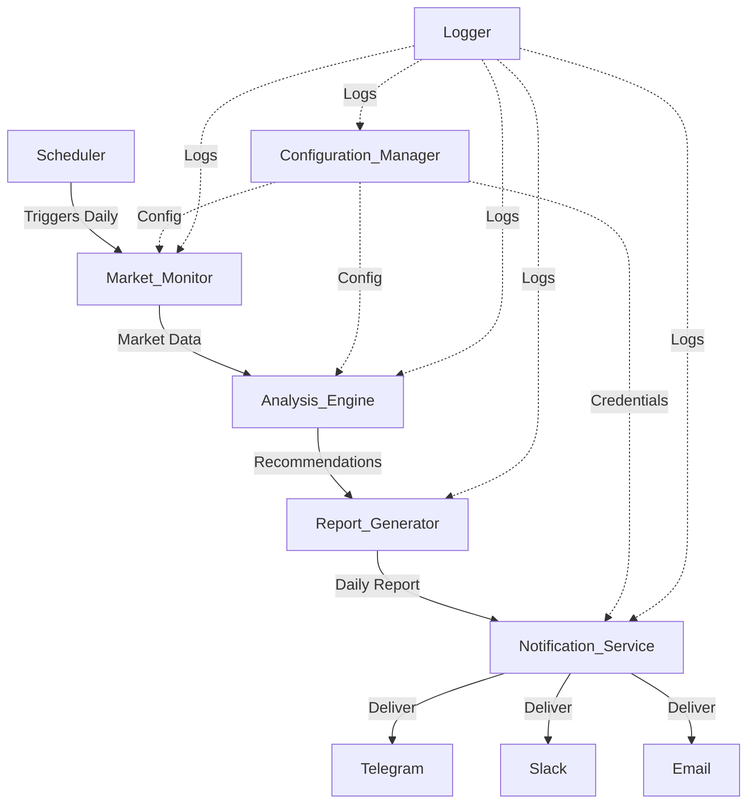

# Design Document: Stock Market Analysis and Recommendation System

## Overview

The Stock Market Analysis and Recommendation System is a scheduled service that monitors multiple stock markets, performs technical and fundamental analysis, and delivers actionable investment recommendations through multiple communication channels. The system operates autonomously on a daily schedule, collecting market data after trading hours, generating analysis-driven recommendations, and distributing comprehensive reports via Telegram, Slack, and Email.

The architecture follows a pipeline pattern with five core components:
1. **Market_Monitor**: Data collection from configured market regions
2. **Analysis_Engine**: Stock analysis and recommendation generation
3. **Report_Generator**: Daily report compilation and formatting
4. **Notification_Service**: Multi-channel report delivery
5. **Configuration_Manager**: System settings and credentials management

The system is designed for reliability with graceful degradation - failures in individual market regions or notification channels do not prevent the system from continuing operations for unaffected components.

## Architecture

### System Architecture

The system follows a pipeline architecture with clear separation of concerns:



### Component Responsibilities

**Market_Monitor**
- Collects stock market data from configured regions (China, Hong Kong, USA by default)
- Handles data source failures gracefully
- Timestamps all collected data
- Executes once per trading day per region

**Analysis_Engine**
- Processes market data to identify investment opportunities
- Generates buy/sell/hold recommendations with rationale
- Includes risk assessment for each recommendation
- Filters out stocks with insufficient data
- Executes after market close times
- Implements retry logic (3 attempts, 5-minute intervals)

**Report_Generator**
- Compiles all recommendations into a structured daily report
- Includes market summaries for each region
- Adds generation timestamp
- Handles days with no recommendations

**Notification_Service**
- Delivers reports through three channels: Telegram, Slack, Email
- Formats reports appropriately for each channel
- Continues delivery on individual channel failures
- Logs all delivery attempts

**Configuration_Manager**
- Manages market region settings (add/remove regions)
- Stores notification channel credentials
- Validates configuration changes
- Persists settings across restarts
- Applies changes within 60 seconds

### Data Flow

1. **Scheduled Trigger**: Daily scheduler initiates the pipeline after market close
2. **Data Collection**: Market_Monitor fetches data from all configured regions
3. **Analysis**: Analysis_Engine processes data and generates recommendations
4. **Report Generation**: Report_Generator compiles recommendations into formatted report
5. **Distribution**: Notification_Service delivers report through all channels
6. **Logging**: All operations log success/failure status

### Error Handling Strategy

The system implements graceful degradation:
- Market region failures don't stop monitoring of other regions
- Notification channel failures don't prevent delivery through other channels
- Analysis failures trigger automatic retry (3 attempts)
- All errors are logged with context
- Critical errors don't cascade to unaffected components

## Components and Interfaces

### Market_Monitor

**Responsibilities:**
- Collect stock market data from configured regions
- Handle data source unavailability
- Timestamp collected data

**Public Interface:**
```python
class MarketMonitor:
    def collect_market_data(self, regions: List[MarketRegion]) -> MarketDataCollection:
        """
        Collects market data from specified regions.
        
        Args:
            regions: List of market regions to monitor
            
        Returns:
            MarketDataCollection containing data from all available regions
            
        Raises:
            No exceptions - logs errors and continues with available regions
        """
        pass
    
    def get_last_collection_time(self, region: MarketRegion) -> Optional[datetime]:
        """Returns the timestamp of the last successful data collection for a region."""
        pass
```

**Dependencies:**
- Configuration_Manager (for region list)
- Logger (for error logging)
- External market data APIs

### Analysis_Engine

**Responsibilities:**
- Analyze market data
- Generate stock recommendations
- Classify recommendations (buy/sell/hold)
- Include rationale and risk assessment
- Handle insufficient data scenarios

**Public Interface:**
```python
class AnalysisEngine:
    def analyze_and_recommend(self, market_data: MarketDataCollection) -> List[StockRecommendation]:
        """
        Analyzes market data and generates recommendations.
        
        Args:
            market_data: Collection of market data from all regions
            
        Returns:
            List of stock recommendations with rationale and risk assessment
            
        Note:
            Stocks with insufficient data are excluded from results
        """
        pass
    
    def execute_scheduled_analysis(self) -> AnalysisResult:
        """
        Executes the full analysis pipeline with retry logic.
        
        Returns:
            AnalysisResult containing recommendations or error information
            
        Implements 3 retry attempts with 5-minute intervals on failure
        """
        pass
```

**Dependencies:**
- Market_Monitor (for market data)
- Configuration_Manager (for analysis parameters)
- Logger (for execution logging)

### Report_Generator

**Responsibilities:**
- Compile daily reports from recommendations
- Include market summaries
- Add generation timestamps
- Handle zero-recommendation scenarios

**Public Interface:**
```python
class ReportGenerator:
    def generate_daily_report(self, recommendations: List[StockRecommendation], 
                             market_summaries: Dict[MarketRegion, MarketSummary]) -> DailyReport:
        """
        Generates a comprehensive daily report.
        
        Args:
            recommendations: List of stock recommendations for the day
            market_summaries: Summary information for each market region
            
        Returns:
            DailyReport with all recommendations and summaries
            
        Note:
            Creates report even when recommendations list is empty
        """
        pass
```

**Dependencies:**
- Analysis_Engine (for recommendations)
- Market_Monitor (for market summaries)
- Logger (for generation logging)

### Notification_Service

**Responsibilities:**
- Deliver reports through multiple channels
- Format reports for each channel
- Handle channel-specific failures
- Log delivery attempts

**Public Interface:**
```python
class NotificationService:
    def deliver_report(self, report: DailyReport) -> DeliveryResult:
        """
        Delivers report through all configured channels.
        
        Args:
            report: The daily report to deliver
            
        Returns:
            DeliveryResult containing success/failure status for each channel
            
        Note:
            Continues delivery through remaining channels on individual failures
        """
        pass
    
    def deliver_to_telegram(self, report: DailyReport) -> bool:
        """Delivers report via Telegram. Returns success status."""
        pass
    
    def deliver_to_slack(self, report: DailyReport) -> bool:
        """Delivers report via Slack. Returns success status."""
        pass
    
    def deliver_to_email(self, report: DailyReport) -> bool:
        """Delivers report via Email. Returns success status."""
        pass
```

**Dependencies:**
- Configuration_Manager (for channel credentials)
- Logger (for delivery logging)
- External APIs (Telegram Bot API, Slack Webhooks, SMTP server)

### Configuration_Manager

**Responsibilities:**
- Manage market region configuration
- Store notification channel credentials
- Validate configuration changes
- Persist settings
- Apply changes to system

**Public Interface:**
```python
class ConfigurationManager:
    def add_market_region(self, region: MarketRegion) -> Result[None, str]:
        """
        Adds a market region to monitoring list.
        
        Returns:
            Success or error message
        """
        pass
    
    def remove_market_region(self, region: MarketRegion) -> Result[None, str]:
        """
        Removes a market region from monitoring list.
        
        Returns:
            Success or error message if removal would leave zero regions
        """
        pass
    
    def get_configured_regions(self) -> List[MarketRegion]:
        """
        Returns list of configured market regions.
        
        Returns default regions (China, Hong Kong, USA) if none configured.
        """
        pass
    
    def set_telegram_config(self, bot_token: str, chat_ids: List[str]) -> Result[None, str]:
        """Validates and stores Telegram configuration."""
        pass
    
    def set_slack_config(self, webhook_url: str, channel: str) -> Result[None, str]:
        """Validates and stores Slack configuration."""
        pass
    
    def set_email_config(self, smtp_settings: SMTPConfig, recipients: List[str]) -> Result[None, str]:
        """Validates and stores Email configuration."""
        pass
    
    def persist_configuration(self) -> None:
        """Saves configuration to persistent storage."""
        pass
    
    def load_configuration(self) -> None:
        """Loads configuration from persistent storage."""
        pass
```

**Dependencies:**
- Logger (for configuration change logging)
- Persistent storage (file system or database)

### Scheduler

**Responsibilities:**
- Trigger daily analysis execution
- Respect market close times
- Support custom schedules

**Public Interface:**
```python
class Scheduler:
    def schedule_daily_analysis(self, market_regions: List[MarketRegion]) -> None:
        """
        Schedules analysis to run after market close for each region.
        
        Args:
            market_regions: Regions to consider for scheduling
        """
        pass
    
    def set_custom_schedule(self, cron_expression: str) -> Result[None, str]:
        """
        Sets a custom schedule for analysis execution.
        
        Args:
            cron_expression: Cron-style schedule expression
            
        Returns:
            Success or validation error
        """
        pass
```

**Dependencies:**
- Analysis_Engine (to trigger execution)
- Configuration_Manager (for schedule settings)

## Data Models

### MarketRegion

Represents a geographic stock market area.

```python
class MarketRegion(Enum):
    CHINA = "china"
    HONG_KONG = "hong_kong"
    USA = "usa"
    # Extensible for additional regions
```

### MarketData

Raw market data for a single stock.

```python
@dataclass
class MarketData:
    symbol: str
    region: MarketRegion
    timestamp: datetime
    open_price: Decimal
    close_price: Decimal
    high_price: Decimal
    low_price: Decimal
    volume: int
    additional_metrics: Dict[str, Any]  # Extensible for technical indicators
```

### MarketDataCollection

Collection of market data from multiple regions.

```python
@dataclass
class MarketDataCollection:
    collection_time: datetime
    data_by_region: Dict[MarketRegion, List[MarketData]]
    failed_regions: List[MarketRegion]  # Regions that failed to collect
```

### StockRecommendation

A buy/sell/hold recommendation with supporting analysis.

```python
class RecommendationType(Enum):
    BUY = "buy"
    SELL = "sell"
    HOLD = "hold"

@dataclass
class StockRecommendation:
    symbol: str
    region: MarketRegion
    recommendation_type: RecommendationType
    rationale: str  # Human-readable explanation
    risk_assessment: str  # Risk level and factors
    confidence_score: float  # 0.0 to 1.0
    target_price: Optional[Decimal]
    generated_at: datetime
```

### MarketSummary

Summary information for a market region.

```python
@dataclass
class MarketSummary:
    region: MarketRegion
    trading_date: date
    total_stocks_analyzed: int
    market_trend: str  # "bullish", "bearish", "neutral"
    notable_events: List[str]
    index_performance: Dict[str, Decimal]  # Index name -> performance percentage
```

### DailyReport

Comprehensive daily report containing all recommendations and summaries.

```python
@dataclass
class DailyReport:
    report_id: str  # Unique identifier
    generation_time: datetime
    trading_date: date
    recommendations: List[StockRecommendation]
    market_summaries: Dict[MarketRegion, MarketSummary]
    
    def has_recommendations(self) -> bool:
        """Returns True if report contains any recommendations."""
        return len(self.recommendations) > 0
    
    def format_for_telegram(self) -> str:
        """Formats report for Telegram delivery."""
        pass
    
    def format_for_slack(self) -> str:
        """Formats report for Slack delivery."""
        pass
    
    def format_for_email(self) -> str:
        """Formats report for Email delivery (HTML)."""
        pass
```

### Configuration Models

```python
@dataclass
class TelegramConfig:
    bot_token: str
    chat_ids: List[str]

@dataclass
class SlackConfig:
    webhook_url: str
    channel: str

@dataclass
class SMTPConfig:
    host: str
    port: int
    username: str
    password: str
    use_tls: bool

@dataclass
class EmailConfig:
    smtp: SMTPConfig
    recipients: List[str]
    sender_address: str

@dataclass
class SystemConfiguration:
    market_regions: List[MarketRegion]
    telegram: Optional[TelegramConfig]
    slack: Optional[SlackConfig]
    email: Optional[EmailConfig]
    custom_schedule: Optional[str]  # Cron expression
    
    def get_default_regions() -> List[MarketRegion]:
        """Returns default regions: China, Hong Kong, USA."""
        return [MarketRegion.CHINA, MarketRegion.HONG_KONG, MarketRegion.USA]
```

### Result Types

```python
@dataclass
class AnalysisResult:
    success: bool
    recommendations: List[StockRecommendation]
    error_message: Optional[str]
    retry_count: int

@dataclass
class DeliveryResult:
    telegram_success: bool
    slack_success: bool
    email_success: bool
    errors: Dict[str, str]  # Channel name -> error message
    
    def all_succeeded(self) -> bool:
        """Returns True if all channels delivered successfully."""
        return self.telegram_success and self.slack_success and self.email_success
    
    def any_succeeded(self) -> bool:
        """Returns True if at least one channel delivered successfully."""
        return self.telegram_success or self.slack_success or self.email_success
```


## Correctness Properties

*A property is a characteristic or behavior that should hold true across all valid executions of a system—essentially, a formal statement about what the system should do. Properties serve as the bridge between human-readable specifications and machine-verifiable correctness guarantees.*

### Property 1: Complete Region Data Collection

*For any* list of configured market regions, when the Market_Monitor collects data, the resulting MarketDataCollection should contain data entries for all regions that are available (not in the failed_regions list).

**Validates: Requirements 1.1**

### Property 2: Graceful Region Failure Handling

*For any* list of market regions where some regions fail during collection, the Market_Monitor should successfully collect data from all non-failing regions and include the failing regions in the failed_regions list.

**Validates: Requirements 1.3**

### Property 3: Market Data Timestamp Presence

*For any* MarketDataCollection returned by the Market_Monitor, all MarketData entries should have non-null timestamps.

**Validates: Requirements 1.5**

### Property 4: Recommendation Completeness

*For any* StockRecommendation generated by the Analysis_Engine, it should have a valid classification (buy/sell/hold), a non-empty rationale, and a non-empty risk assessment.

**Validates: Requirements 2.2, 2.3, 2.4**

### Property 5: Insufficient Data Exclusion

*For any* market data where some stocks have insufficient data for analysis, those stocks should not appear in the generated recommendations list.

**Validates: Requirements 2.5**

### Property 6: Report Includes All Recommendations

*For any* list of StockRecommendations, when a DailyReport is generated, the report should contain all recommendations from the input list.

**Validates: Requirements 3.2**

### Property 7: Report Includes All Region Summaries

*For any* set of configured market regions, when a DailyReport is generated, the report should contain market summaries for each configured region.

**Validates: Requirements 3.3**

### Property 8: Report Timestamp Presence

*For any* DailyReport generated, it should have a non-null generation_time timestamp.

**Validates: Requirements 3.4**

### Property 9: Multi-Channel Delivery Attempts

*For any* DailyReport, when delivered through the Notification_Service, all three delivery methods (Telegram, Slack, Email) should be attempted.

**Validates: Requirements 4.1, 4.2, 4.3**

### Property 10: Channel Failure Isolation

*For any* DailyReport delivery where one or more channels fail, the Notification_Service should still attempt delivery through all remaining channels and return a DeliveryResult indicating which channels succeeded and which failed.

**Validates: Requirements 4.4**

### Property 11: Channel-Specific Formatting

*For any* DailyReport, the formatted output for each channel (Telegram, Slack, Email) should be non-empty and contain key report information (recommendations count, generation time).

**Validates: Requirements 4.5**

### Property 12: Region Addition Persistence

*For any* MarketRegion, when added to the Configuration_Manager, it should appear in the list of configured regions returned by get_configured_regions().

**Validates: Requirements 5.1**

### Property 13: Region Removal Persistence

*For any* MarketRegion that exists in the configured regions list (and is not the last region), when removed from the Configuration_Manager, it should not appear in the list of configured regions returned by get_configured_regions().

**Validates: Requirements 5.2**

### Property 14: Configuration Persistence Round-Trip

*For any* valid SystemConfiguration, when saved via persist_configuration() and then loaded via load_configuration(), the loaded configuration should match the saved configuration.

**Validates: Requirements 5.5, 6.1, 6.2, 6.3**

### Property 15: Invalid Credentials Rejection

*For any* invalid notification channel credentials (malformed tokens, invalid URLs, incorrect SMTP settings), the Configuration_Manager should reject them and return an error result.

**Validates: Requirements 6.4**

### Property 16: Descriptive Error Messages

*For any* invalid configuration input, the Configuration_Manager should return an error message that is non-empty and describes the validation failure.

**Validates: Requirements 6.5**

### Property 17: Analysis Retry Count

*For any* analysis execution that fails, the Analysis_Engine should retry up to 3 times before returning a failure result, and the AnalysisResult should reflect the correct retry_count.

**Validates: Requirements 7.4**

### Property 18: Comprehensive Event Logging

*For any* significant system event (errors, report generation, delivery attempts, configuration changes), the system should create a log entry with a timestamp and relevant context information.

**Validates: Requirements 8.1, 8.2, 8.3, 8.4**

### Property 19: Component Failure Isolation

*For any* critical error in one component (Market_Monitor, Analysis_Engine, or Notification_Service), other unaffected components should continue to operate normally.

**Validates: Requirements 8.5**

## Error Handling

The system implements a comprehensive error handling strategy based on graceful degradation and fault isolation:

### Error Categories

**Recoverable Errors:**
- Individual market region data collection failures
- Individual notification channel delivery failures
- Temporary analysis failures (handled by retry logic)

**Non-Recoverable Errors:**
- Invalid configuration that violates system constraints
- Persistent analysis failures after all retries
- Critical system component failures

### Error Handling Patterns

**Graceful Degradation:**
- Market region failures don't prevent collection from other regions
- Notification channel failures don't prevent delivery through other channels
- Component failures don't cascade to unaffected components

**Retry Logic:**
- Analysis failures trigger automatic retry (3 attempts)
- Each retry is logged with attempt number
- After exhausting retries, system logs failure and continues with other operations

**Error Logging:**
- All errors are logged with timestamp and context
- Error logs include component name, operation, and error details
- Critical errors trigger administrator notifications

**Validation:**
- Configuration changes are validated before application
- Invalid inputs return descriptive error messages
- System maintains valid state even when operations fail

### Error Response Patterns

```python
# Pattern 1: Graceful degradation with partial results
def collect_market_data(regions: List[MarketRegion]) -> MarketDataCollection:
    successful_data = []
    failed_regions = []
    
    for region in regions:
        try:
            data = fetch_data_for_region(region)
            successful_data.append(data)
        except Exception as e:
            logger.error(f"Failed to collect data for {region}: {e}")
            failed_regions.append(region)
    
    return MarketDataCollection(
        collection_time=datetime.now(),
        data_by_region=successful_data,
        failed_regions=failed_regions
    )

# Pattern 2: Retry with exponential backoff
def execute_scheduled_analysis() -> AnalysisResult:
    max_retries = 3
    retry_count = 0
    
    while retry_count < max_retries:
        try:
            recommendations = perform_analysis()
            return AnalysisResult(
                success=True,
                recommendations=recommendations,
                error_message=None,
                retry_count=retry_count
            )
        except Exception as e:
            retry_count += 1
            logger.warning(f"Analysis attempt {retry_count} failed: {e}")
            if retry_count < max_retries:
                time.sleep(300)  # 5 minutes
    
    logger.error("All analysis retry attempts failed")
    notify_administrators("Analysis execution failed after all retries")
    return AnalysisResult(
        success=False,
        recommendations=[],
        error_message="Analysis failed after 3 retry attempts",
        retry_count=retry_count
    )

# Pattern 3: Validation with descriptive errors
def set_telegram_config(bot_token: str, chat_ids: List[str]) -> Result[None, str]:
    if not bot_token or len(bot_token) < 10:
        return Err("Invalid bot token: must be at least 10 characters")
    
    if not chat_ids or len(chat_ids) == 0:
        return Err("Invalid chat IDs: at least one chat ID required")
    
    for chat_id in chat_ids:
        if not chat_id.isdigit() and not chat_id.startswith("-"):
            return Err(f"Invalid chat ID format: {chat_id}")
    
    # Validate by attempting to connect
    try:
        validate_telegram_credentials(bot_token, chat_ids)
    except Exception as e:
        return Err(f"Telegram credential validation failed: {str(e)}")
    
    self.telegram_config = TelegramConfig(bot_token, chat_ids)
    return Ok(None)
```

### Error Monitoring

The system maintains error metrics for monitoring:
- Count of failed market region collections per day
- Count of failed notification deliveries per channel
- Analysis failure rate and retry statistics
- Configuration validation failure rate

These metrics help identify systemic issues and guide system improvements.

## Testing Strategy

The testing strategy employs a dual approach combining unit tests for specific scenarios and property-based tests for comprehensive coverage.

### Testing Approach

**Unit Tests:**
- Specific examples demonstrating correct behavior
- Edge cases (empty inputs, boundary conditions)
- Error conditions and validation failures
- Integration points between components

**Property-Based Tests:**
- Universal properties that hold for all inputs
- Comprehensive input coverage through randomization
- Minimum 100 iterations per property test
- Each test references its design document property

### Property-Based Testing Framework

**Language:** Python
**Framework:** Hypothesis (https://hypothesis.readthedocs.io/)

Hypothesis provides:
- Automatic test case generation
- Shrinking of failing examples
- Stateful testing capabilities
- Excellent integration with pytest

**Configuration:**
```python
from hypothesis import given, settings, strategies as st

# Standard configuration for all property tests
@settings(max_examples=100)
```

### Test Organization

```
tests/
├── unit/
│   ├── test_market_monitor.py
│   ├── test_analysis_engine.py
│   ├── test_report_generator.py
│   ├── test_notification_service.py
│   └── test_configuration_manager.py
├── property/
│   ├── test_properties_market_monitor.py
│   ├── test_properties_analysis_engine.py
│   ├── test_properties_report_generator.py
│   ├── test_properties_notification_service.py
│   └── test_properties_configuration_manager.py
└── integration/
    ├── test_end_to_end_pipeline.py
    └── test_scheduler_integration.py
```

### Property Test Examples

**Property 1: Complete Region Data Collection**
```python
from hypothesis import given, settings
from hypothesis import strategies as st

@settings(max_examples=100)
@given(regions=st.lists(st.sampled_from(MarketRegion), min_size=1, max_size=5))
def test_complete_region_data_collection(regions):
    """
    Feature: stock-market-analysis, Property 1: 
    For any list of configured market regions, when the Market_Monitor collects data, 
    the resulting MarketDataCollection should contain data entries for all regions 
    that are available (not in the failed_regions list).
    """
    monitor = MarketMonitor()
    result = monitor.collect_market_data(regions)
    
    # All regions should either have data or be in failed_regions
    collected_regions = set(result.data_by_region.keys())
    failed_regions = set(result.failed_regions)
    all_accounted = collected_regions.union(failed_regions)
    
    assert all_accounted == set(regions)
    # Regions with data should not be in failed list
    assert collected_regions.isdisjoint(failed_regions)
```

**Property 14: Configuration Persistence Round-Trip**
```python
@settings(max_examples=100)
@given(config=st.builds(
    SystemConfiguration,
    market_regions=st.lists(st.sampled_from(MarketRegion), min_size=1, max_size=5),
    custom_schedule=st.one_of(st.none(), st.text(min_size=5, max_size=20))
))
def test_configuration_persistence_round_trip(config, tmp_path):
    """
    Feature: stock-market-analysis, Property 14: 
    For any valid SystemConfiguration, when saved via persist_configuration() 
    and then loaded via load_configuration(), the loaded configuration should 
    match the saved configuration.
    """
    manager = ConfigurationManager(storage_path=tmp_path)
    
    # Save configuration
    manager.set_configuration(config)
    manager.persist_configuration()
    
    # Create new manager instance and load
    new_manager = ConfigurationManager(storage_path=tmp_path)
    new_manager.load_configuration()
    loaded_config = new_manager.get_configuration()
    
    # Configurations should match
    assert loaded_config.market_regions == config.market_regions
    assert loaded_config.custom_schedule == config.custom_schedule
```

### Unit Test Examples

**Edge Case: Empty Recommendations Report**
```python
def test_report_generation_with_no_recommendations():
    """
    Tests that a report is generated even when no recommendations exist.
    Validates: Requirement 3.5
    """
    generator = ReportGenerator()
    market_summaries = {
        MarketRegion.USA: MarketSummary(
            region=MarketRegion.USA,
            trading_date=date.today(),
            total_stocks_analyzed=100,
            market_trend="neutral",
            notable_events=[],
            index_performance={"S&P 500": Decimal("0.5")}
        )
    }
    
    report = generator.generate_daily_report([], market_summaries)
    
    assert report is not None
    assert len(report.recommendations) == 0
    assert not report.has_recommendations()
    assert report.generation_time is not None
```

**Edge Case: Last Region Removal Prevention**
```python
def test_cannot_remove_last_market_region():
    """
    Tests that removing the last market region is prevented.
    Validates: Requirement 5.3
    """
    manager = ConfigurationManager()
    manager.add_market_region(MarketRegion.USA)
    
    result = manager.remove_market_region(MarketRegion.USA)
    
    assert result.is_err()
    assert "at least one" in result.error().lower()
    assert MarketRegion.USA in manager.get_configured_regions()
```

**Edge Case: All Retries Exhausted**
```python
def test_analysis_failure_after_all_retries():
    """
    Tests that analysis logs failure after exhausting all retry attempts.
    Validates: Requirement 7.5
    """
    engine = AnalysisEngine()
    
    # Mock to always fail
    with patch.object(engine, 'perform_analysis', side_effect=Exception("Analysis error")):
        with patch('time.sleep'):  # Skip actual sleep delays
            result = engine.execute_scheduled_analysis()
    
    assert not result.success
    assert result.retry_count == 3
    assert result.error_message is not None
    # Verify administrator notification was sent
    # Verify error was logged
```

### Integration Tests

Integration tests verify the complete pipeline:

```python
def test_end_to_end_daily_pipeline():
    """
    Tests the complete daily analysis pipeline from data collection to notification.
    """
    # Setup
    config_manager = ConfigurationManager()
    config_manager.add_market_region(MarketRegion.USA)
    
    monitor = MarketMonitor(config_manager)
    engine = AnalysisEngine()
    generator = ReportGenerator()
    notifier = NotificationService(config_manager)
    
    # Execute pipeline
    market_data = monitor.collect_market_data(config_manager.get_configured_regions())
    recommendations = engine.analyze_and_recommend(market_data)
    report = generator.generate_daily_report(recommendations, market_data.summaries)
    delivery_result = notifier.deliver_report(report)
    
    # Verify
    assert market_data is not None
    assert len(recommendations) >= 0
    assert report is not None
    assert delivery_result.any_succeeded()
```

### Test Coverage Goals

- Unit test coverage: >90% for all components
- Property test coverage: 100% of correctness properties
- Integration test coverage: All major workflows
- Edge case coverage: All identified edge cases from requirements

### Continuous Testing

- All tests run on every commit
- Property tests run with increased iterations (1000) in CI/CD
- Integration tests run in staging environment
- Performance benchmarks track analysis execution time
